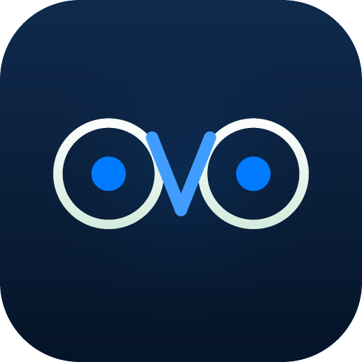

<div align="center">



# Ovo

### 开源主动式 AI 桌面助手<br/>看着你的屏幕，主动给建议，所有数据 100% 在你电脑上

<p>
  <a href="https://github.com/dushaobindoudou/ovo/releases/latest"></a>
  <a href="https://github.com/dushaobindoudou/ovo/releases/latest"></a>
  <a href="LICENSE"></a>
  <a href="https://github.com/dushaobindoudou/ovo/actions/workflows/ci.yml"></a>
  <a href="CODE_OF_CONDUCT.md"></a>
</p>

<p>
  <a href="https://github.com/dushaobindoudou/ovo/stargazers"></a>
  <a href="https://github.com/dushaobindoudou/ovo/network/members"></a>
  <a href="https://github.com/dushaobindoudou/ovo/discussions"></a>
  <a href="https://github.com/dushaobindoudou/ovo/issues?q=label%3A%22good+first+issue%22"></a>
</p>

<p>
  <a href="README.md">English</a> · <b>简体中文</b>
</p>

<p>
  <a href="https://github.com/dushaobindoudou/ovo/releases/latest">⬇ 下载 macOS 版</a> ·
  <a href="docs/PRODUCT_PHILOSOPHY.md">📖 产品哲学</a> ·
  <a href="https://github.com/dushaobindoudou/ovo/discussions">💬 讨论区</a> ·
  <a href="CONTRIBUTING.md">🤝 贡献指南</a>
</p>

</div>

---

<p align="center">
  
  <br/>
  <em>Ovo 看到 Gmail 草稿，预测了回复，并准备好剪贴板 —— 全程可见，全程可审计。</em>
</p>

---

## 🪟 Ovo 是什么？

**Ovo 是一个主动式 AI 桌面助手 —— 在你开口前就开始帮你。**

今天市面上的 AI 工具都在等你输入 prompt，Ovo 反过来：

- 它每隔几秒**观察你的屏幕**（OCR + 窗口上下文）
- 它通过**多轮推理 + 知识图谱**理解你正在做什么
- 它**主动建议下一步** —— 草拟邮件回复、复制片段、提醒截止时间
- 它在一个**透明的时间线**里展示每一步思考 —— 没有黑盒，没有魔法
- 它会**从你的反馈中学习** —— 接受、拒绝、或者教 Ovo 永远不要再这么做

为想要 AI 真正陪伴日常工作 —— 但又不愿放弃控制权、透明度和隐私的人而生。

---

## 🛡️ 给中国用户的隐私承诺

> **我做的是一个会截屏的 AI，深知信任成本有多高。所以 Ovo 从设计第一天就做到：**

- ✅ **截图和 OCR 全部在你的电脑上完成** —— 任何截图、OCR 文本都不会离开你的设备
- ✅ **自带你的 Claude / OpenAI API Key** —— 直接调你的账号，**不经过任何中转服务器**
- ✅ **API Key 用 macOS Keychain 加密** —— 渲染进程永远拿不到明文
- ✅ **完整开源，MIT 协议** —— 所有代码可审计，欢迎安全研究员
- ✅ **默认零遥测** —— Ovo 不收集任何使用数据
- ✅ **敏感信息自动脱敏** —— 发送给 LLM 前自动擦除 API Key / JWT / 银行卡号 / 身份证 / 手机号 / 密码
- ✅ **App 级别黑名单** —— 1Password / 工商银行 / 微信支付等敏感应用永不观察
- ✅ **一键暂停**（5/15/60 分钟） —— 需要做敏感事情时立刻停下
- ✅ **数据可一键导出 / 一键删除** —— 你的画像永远归你

> 不放心？打开 Ovo → 设置 → 隐私 → 看到所有规则；或者读源码 `electron/sensitive-filter.ts` 验证脱敏规则。

---

## ✨ Ovo 的 5 个核心差异化

### 🚀 主动，不是被动
ChatGPT 等你输入 prompt 时，Ovo 已经看到你在写一封邮件给客户，并**默默准备好了回复草稿**。你看到建议，决定要不要采纳。零输入成本。

### 🪟 玻璃箱式透明
其他 AI 都是黑盒。Ovo 给你看：
- 📸 它看到了什么（屏幕 OCR 文本）
- 🧠 它怎么想的（送给 LLM 的完整 prompt）
- 💡 它怎么决定的（结构化建议 + 置信度）
- ⚡ 它做了什么（每个 action 的输出 + 耗时）

点开任何一条建议 → 看完整的推理链。再也不会"AI 为什么这么说？"

### 🎓 可教，不是固执
不喜欢某条建议？你可以：
- **拒绝这一次** —— Ovo 记下来，不再重复犯
- **"永远不要这么做"** —— Ovo 写入知识图谱作为永久规则
- **调整信任级别** —— 给 Ovo 不同 action 不同的自主权

Ovo 从你的反馈中变聪明，不是从云端遥测。

### 🔒 本地优先，自带 LLM Key
- 截图和 OCR **在你机器上发生** —— 永不上传
- 自带 Claude / OpenAI / 本地 LLM key —— 不经过任何代理服务器
- 内置敏感信息脱敏（API key / JWT / 银行卡 / 身份证）
- App 级黑名单（密码管理器、银行 App 等永不观察）
- 硬性暂停（5/15/60 分钟）—— 需要隐私时立刻停下

### 🧠 长期记忆 —— 知识图谱
Ovo 边用边构建你的个人知识图谱：
- **实体**（人、项目、文档、概念）
- **关系**（实体之间的联系）
- **记忆事件**（带时间线 + 意图标签）
- **人格画像**（基于你的行为模式演化）

打开记忆面板 → 看 Ovo 究竟知道你什么。可以编辑、置顶重要实体、删除任何不想被记住的内容。

---

## 🆚 Ovo vs 其他 AI 工具

|                          | ChatGPT 桌面 | Rewind | Cursor | Granola | **Ovo** |
|--------------------------|:---:|:---:|:---:|:---:|:---:|
| 主动建议（无需输入）         | ❌ | ❌ | 部分（仅 IDE） | 部分（仅会议） | ✅ |
| 屏幕感知                   | ❌ | ✅（仅录制） | ✅（仅 IDE） | ✅（仅录音） | ✅ |
| 推理过程透明               | ❌ | N/A | ❌ | ❌ | ✅ |
| 每个 action 可教           | ❌ | ❌ | 部分 | ❌ | ✅ |
| 本地优先 / 自带 Key         | ❌ | 部分 | ❌ | ❌ | ✅ |
| 开源                       | ❌ | ❌ | ❌ | ❌ | ✅ |
| 知识图谱长期记忆           | ❌ | ❌ | ❌ | ❌ | ✅ |

---

## 📥 安装

### 方式一：下载（推荐）

<p>
  <a href="https://github.com/dushaobindoudou/ovo/releases/latest">
    
  </a>
</p>

> **macOS 首次启动**：在我们完成签名/公证前，系统会提示 "无法打开 Ovo，因为无法验证开发者"。**右键 → 打开 → 打开**，只需一次。

> **Windows / Linux**：v0.5+ 支持。Star 仓库及时收到通知。

### 方式二：从源码构建

```bash
git clone https://github.com/dushaobindoudou/ovo.git
cd ovo
pnpm install
pnpm dev          # 开发模式（Vite + Electron 热重载）
# 或
pnpm pack:mac     # 构建 DMG 到 out/ 目录
```

**环境要求**：Node 20+ · pnpm 10+ · macOS（Apple Silicon 或 Intel）

### 首次使用

1. **授权屏幕录制权限** —— Ovo 会引导你打开系统设置
2. **配置 AI 后端** —— Claude Code / OpenClaw / Hermes / 直接 API 四选一
3. **填入你的 API Key**（macOS Keychain 加密，绝不上传）
4. **告诉 Ovo 关于你**（可选 4 步引导，让知识图谱有起点）

完成后 1-2 分钟，Ovo 就开始观察并给建议。

---

## 🖼️ 截图展示

> _截图和 GIF 将在 v0.2 release 中补充。欢迎 PR — 见 [#good-first-issue](https://github.com/dushaobindoudou/ovo/labels/good%20first%20issue)。_

| 控制台主窗口 | 浮动球（常驻置顶） | 建议 Toast |
|---|---|---|
| _占位_ | _占位_ | _占位_ |

| 知识图谱 | Pipeline 时间线（推理透明） | 设置 — 隐私面板 |
|---|---|---|
| _占位_ | _占位_ | _占位_ |

---

## 🏗 架构

```
┌─────────────────────────────────────────────────────────────┐
│  渲染进程（React + Zustand）                                │
│  ┌──────────────┐  ┌────────────────┐  ┌────────────────┐  │
│  │ 主控制台      │  │ 浮动球          │  │ 建议面板/Toast │  │
│  │ (#console)   │  │ (#float)       │  │ (#panel/toast) │  │
│  └──────┬───────┘  └───────┬────────┘  └───────┬────────┘  │
└─────────┼──────────────────┼───────────────────┼───────────┘
          │   IPC（preload.cjs，context-isolated）
┌─────────▼──────────────────▼───────────────────▼───────────┐
│  Electron 主进程                                            │
│  ┌──────────────┐  ┌────────────────┐  ┌────────────────┐  │
│  │ 自动截屏      │→ │ OCR 引擎        │→ │ 事件处理器     │  │
│  │ (5s/次)      │  │ (Tesseract)    │  │ (意图推断)      │  │
│  └──────────────┘  └────────────────┘  └───────┬────────┘  │
│                                                ▼            │
│  ┌──────────────────────────────────────────────────────┐  │
│  │ 多 Pass Prompt 引擎                                  │  │
│  │ Pass 1：观察（意图 + 实体）                          │  │
│  │ Pass 2：合成（预测 + actions）                       │  │
│  └────────────┬─────────────────────────────────────────┘  │
│               ▼                                              │
│  ┌──────────────────────────────────────────────────────┐  │
│  │ Agent Bridge (Claude Code / OpenClaw / Hermes / API) │  │
│  └────────────┬─────────────────────────────────────────┘  │
│               ▼                                              │
│  ┌──────────────┐  ┌────────────────┐  ┌────────────────┐  │
│  │ 知识图谱      │  │ Action 执行器   │  │ 反馈引擎       │  │
│  │ (SQLite)     │  │                │  │                │  │
│  └──────────────┘  └────────────────┘  └────────────────┘  │
└─────────────────────────────────────────────────────────────┘
```

**技术栈**：Electron 34 · React 19 · TypeScript · Vite · Tailwind · better-sqlite3 · Tesseract.js · Zustand

详见 [`docs/PRODUCT_PHILOSOPHY.md`](docs/PRODUCT_PHILOSOPHY.md) 和 [`docs/ELECTRON_IPC_MAPPING.md`](docs/ELECTRON_IPC_MAPPING.md)。

---

## 🗺 路线图

**已发布** ✅
- 多 Pass Prompt 引擎（观察 → 合成）
- 4 个 AI 后端（Claude Code / OpenClaw / Hermes / 直接 API）
- 知识图谱（实体 / 关系 / 记忆事件）
- Pipeline 全链路透明（每步可查）
- 隐私控制（暂停 / 黑名单 / 敏感信息脱敏）
- Prompt 自评（Ovo 反思自己的 pipeline 质量）
- 4 步 Bootstrap 引导

**进行中** 🚧
- 信任分级 UI（每种 action 独立 5 级自主权：展示 → 草拟 → 确认 → 自动+5秒撤销 → 完全托管）
- 玻璃管家浮窗（实时显示"Ovo 正在做 X，因为 Y"+ [让它做] [不要做] [永远别这样] 三按钮）
- AI 行为时间线升主屏（当前藏在二级面板）

**计划中** 🔮
- Windows + Linux 支持
- 插件/扩展系统
- KPI 看板（TTFV / 命中率 / 撤销率 —— 详见 [`PRODUCT_PHILOSOPHY.md`](docs/PRODUCT_PHILOSOPHY.md)）
- macOS 公证 + 自动更新
- 多语言 UI

查看 [开放 milestones](https://github.com/dushaobindoudou/ovo/milestones) 了解最新进展。

---

## 📚 文档

### 先读这里

| 文档 | 用途 |
|---|---|
| [`AGENT_PHILOSOPHY.md`](docs/AGENT_PHILOSOPHY.md) | **核心思想。** 两类 agent（工具型 vs 副驾型）— 为什么 Ovo 是被低估的那一类 |
| [`PRODUCT_PHILOSOPHY.md`](docs/PRODUCT_PHILOSOPHY.md) | 项目宪法 —— 参与产品方向先读这个 |
| [`USE_CASES.md`](docs/USE_CASES.md) | 10 个具体场景：副驾驶在哪些时刻为你创造价值 |
| [`PRIVACY.md`](docs/PRIVACY.md) | Ovo 收集什么（不收集什么）—— 完整数据流审计 |

### 构建 / 使用

| 文档 | 用途 |
|---|---|
| [`ARCHITECTURE.md`](docs/ARCHITECTURE.md) | 深度技术架构 —— 进程拓扑 / 数据流 / KG schema / IPC 契约 |
| [`AI_BACKENDS.md`](docs/AI_BACKENDS.md) | 4 个后端选择（Claude Code / OpenClaw / Hermes / 直接 API）配置 + 取舍 |
| [`ELECTRON_IPC_MAPPING.md`](docs/ELECTRON_IPC_MAPPING.md) | IPC 通道与 payload 契约 |
| [`RELEASE_PROCESS.md`](docs/RELEASE_PROCESS.md) | 发版流程 |

### 项目状态

| 文档 | 用途 |
|---|---|
| [`UX_AUDIT.md`](docs/UX_AUDIT.md) | 65 个已知 UX 问题（P0 → P3）+ KPI 度量框架 |
| [`BUG_REPORT.md`](docs/BUG_REPORT.md) | QA 跟踪的 bug + 架构反模式 |
| [`UI_DESIGN_AUDIT.md`](docs/UI_DESIGN_AUDIT.md) | 设计系统一致性报告 |
| [`GITHUB_GROWTH_PLAN.md`](docs/GITHUB_GROWTH_PLAN.md) | 90 天 0 → 1k stars 路径 |
| [`GOOD_FIRST_ISSUES.md`](docs/GOOD_FIRST_ISSUES.md) | 新手可以直接领的任务 |
| [`STATUS.md`](docs/STATUS.md) | 各功能当前实现状态 |

---

## 💬 社区

我们在公开构建 Ovo，欢迎来参与：

- 🐙 **[GitHub Discussions](https://github.com/dushaobindoudou/ovo/discussions)** —— 问题、想法、展示
- 🐛 **[Issue 跟踪](https://github.com/dushaobindoudou/ovo/issues)** —— bug 和功能请求
- 💚 **微信群** —— 扫码加入（二维码即将补充）

  > _微信群二维码占位 —— 请添加助手微信 `xxx`，备注 "Ovo"_

- 🐦 **[即刻 @dushaobin](https://web.okjike.com/u/dushaobin)** —— 中文 build-in-public
- 🐦 **[Twitter @dushaobin](https://twitter.com/dushaobin)** —— 英文 build-in-public

---

## 🤝 贡献

非常欢迎贡献 —— 从修改 typo 到加新功能都好。

- **第一次贡献？** 看 [`good first issue`](https://github.com/dushaobindoudou/ovo/labels/good%20first%20issue) —— 每个都有完整上下文、文件指针、验收标准
- **大想法？** 先开 [Discussion](https://github.com/dushaobindoudou/ovo/discussions) 对齐方向
- **提 PR？** 看 [`CONTRIBUTING.md`](CONTRIBUTING.md) 了解开发环境、代码风格、PR 流程

外部 PR 24 小时内必 review + 致谢。🙏

---

## 🔐 安全

发现漏洞？请**不要**公开提 issue。看 [`SECURITY.md`](SECURITY.md) 了解负责任披露流程。

---

## 💖 赞助

如果 Ovo 为你节省了时间，可以这样支持作者：

- ⭐ [Star 这个仓库](https://github.com/dushaobindoudou/ovo) —— 最低成本的支持
- 🐦 [转发到微博/即刻/朋友圈](https://web.okjike.com/u/dushaobin)
- ☕ [爱发电](https://afdian.com/a/dushaobin) （国内） · [Ko-fi](https://ko-fi.com/dushaobin)（海外）
- 🤝 [贡献](CONTRIBUTING.md) 代码、文档、翻译、设计

---

## 📜 协议

[MIT](LICENSE) © 2026 dushaobin

Ovo 永远**开源 + 个人免费**。商业 fork 在 MIT 协议下自由。

---

## 🙏 致谢

Ovo 站在巨人的肩膀上：

- [**Electron**](https://www.electronjs.org/) —— 桌面运行时
- [**React**](https://react.dev/) —— UI 框架
- [**Anthropic Claude**](https://www.anthropic.com/) —— 默认 AI 后端
- [**Tesseract.js**](https://tesseract.projectnaptha.com/) —— OCR 引擎
- [**better-sqlite3**](https://github.com/WiseLibs/better-sqlite3) —— 知识图谱存储
- [**Lucide**](https://lucide.dev/) —— 图标库
- [**Tailwind CSS**](https://tailwindcss.com/) —— 样式
- 以及每一位贡献者 ❤️

---

## ⭐ Star History

<a href="https://star-history.com/#dushaobindoudou/ovo&Date">
  
</a>

---

<div align="center">

**由 [@dushaobindoudou](https://github.com/dushaobindoudou) 和 Ovo 社区用心打造**

如果这个项目对你有共鸣 —— 请 Star 它。真的很有帮助。⭐

</div>
